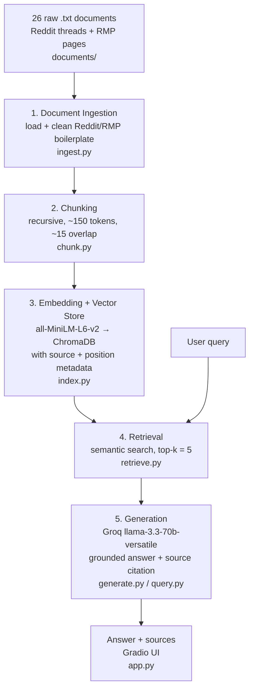

# Project 1 Planning: The Unofficial Guide

> Write this document before you write any pipeline code.
> Your spec and architecture diagram are what you'll use to direct AI tools (Claude, Copilot, etc.) to generate your implementation — the more specific they are, the more useful the generated code will be.
> Update the Retrieval Approach and Chunking Strategy sections if you change your approach during implementation.
> Update this file before starting any stretch features.

---

## Domain

<!-- What domain did you choose? Why is this knowledge valuable and hard to find through official channels? -->
This corpus is real, unofficial UC Berkeley CS student opinion. It comes from r/berkeley Reddit threads and RateMyProfessors reviews, covering core courses like CS61A and CS61B and specific professors like DeNero, Garcia, and Hilfinger. It is the kind of candid, experience-based knowledge students actually use to decide which professor to take, how hard a class really is, and whether a semester's grading was harsher than usual.

This knowledge is valuable because it does more than describe a professor or list what a course covers. It carries the perspective of the students themselves, so a reader can find people like them and judge fit: whether they would work well under a given professor's style and keep up with how a course is actually run. That match between student and professor is the thing official sources never tell you.

Official channels don't carry this. Course catalogs and department pages publish requirements and logistics, not honest takes on teaching quality, workload, or whether a class is worth taking.

---

## Documents

26 documents total: 20 Reddit threads from r/berkeley and 6 RateMyProfessors pages. All stored as plain text in `documents/`. The set covers four subtopics: professor-specific opinion, course difficulty, course sequencing, and general CS-major perspective.

### RateMyProfessors pages

| # | Source | Description | URL or location |
|---|--------|-------------|-----------------|
| 1 | RateMyProfessors | Reviews for John DeNero (CS61A) | `documents/rmp_denero.txt` — https://www.ratemyprofessors.com/professor/1621181 |
| 2 | RateMyProfessors | Reviews for Dan Garcia (CS61A) | `documents/rmp_garcia.txt` — https://www.ratemyprofessors.com/professor/142865 |
| 3 | RateMyProfessors | Reviews for Paul Hilfinger (CS61B) | `documents/rmp_hilfinger.txt` — https://www.ratemyprofessors.com/professor/525740 |
| 4 | RateMyProfessors | Reviews for Satish Rao | `documents/rmp_rao.txt` — https://www.ratemyprofessors.com/professor/226535 |
| 5 | RateMyProfessors | Reviews for Jonathan Shewchuk | `documents/rmp_shewchuk.txt` — https://www.ratemyprofessors.com/professor/246561 |
| 6 | RateMyProfessors | Reviews for Justin Yokota | `documents/rmp_yokota.txt` — https://www.ratemyprofessors.com/professor/2868089 |

### Reddit threads (r/berkeley)

| # | Source | Description | URL or location |
|---|--------|-------------|-----------------|
| 7 | r/berkeley | General opinion on EECS major | `documents/reddit_best_EECS_1.txt` — https://www.reddit.com/r/berkeley/comments/1s4r2m1/opinion_on_eecs/ |
| 8 | r/berkeley | Course advice for freshman EECS | `documents/reddit_best_EECS_2.txt` — https://www.reddit.com/r/berkeley/comments/1u0u86w/course_advice_freshman_eecs/ |
| 9 | r/berkeley | Best professor for EECS16A | `documents/reddit_best_EECS_3.txt` — https://www.reddit.com/r/berkeley/comments/nsh4e4/best_professor_for_eecs_16a/ |
| 10 | r/berkeley | Major recommendations for EECS | `documents/reddit_best_EECS_4.txt` — https://www.reddit.com/r/berkeley/comments/hkk0aw/major_recommendations_for_a_lifeless_eecs_major/ |
| 11 | r/berkeley | Must-take CS upper divs | `documents/reddit_cs_course_sequencing_1.txt` — https://www.reddit.com/r/berkeley/comments/122ea3o/musttake_cs_upper_divs/ |
| 12 | r/berkeley | Easiest CS upper div to take | `documents/reddit_cs_course_sequencing_2.txt` — https://www.reddit.com/r/berkeley/comments/18thykq/easiest_cs_upper_div_to_take/ |
| 13 | r/berkeley | CS upper div recommendations | `documents/reddit_cs_course_sequencing_3.txt` — https://www.reddit.com/r/berkeley/comments/13rz111/cs_upper_divs_class_recommendations/ |
| 14 | r/berkeley | Still pursuing CS (difficulty) | `documents/reddit_cs_difficulty_1.txt` — https://www.reddit.com/r/berkeley/comments/1n3cdw7/anyone_here_still_pursuing_cs/ |
| 15 | r/berkeley | How hard to get into CS major | `documents/reddit_cs_difficulty_2.txt` — https://www.reddit.com/r/berkeley/comments/1dsep0y/cs_majors_how_hard_is_it_to_get_accepted_as_a_cs/ |
| 16 | r/berkeley | Computer science is hard | `documents/reddit_cs_difficulty_3.txt` — https://www.reddit.com/r/berkeley/comments/1gcn9hp/computer_science_is_hard/ |
| 17 | r/berkeley | CS61A difficulty, spring vs fall | `documents/reddit_cs61a_denero_1.txt` — https://www.reddit.com/r/berkeley/comments/1ty5qfw/cs61a_question/ |
| 18 | r/berkeley | Does DeNero teach 61A lectures | `documents/reddit_cs61a_denero_2.txt` — https://www.reddit.com/r/berkeley/comments/1fap17h/does_denero_actually_teach_the_cs61a_lectures/ |
| 19 | r/berkeley | 61A John DeNero | `documents/reddit_cs61a_denero_3.txt` — https://www.reddit.com/r/berkeley/comments/1fjkvcx/61a_john_denero/ |
| 20 | r/berkeley | Review of CS61B with Hilfinger | `documents/reddit_CS61B_Hilfinger_1.txt` — https://www.reddit.com/r/berkeley/comments/gp4mf9/review_of_cs61b_with_hilfinger/ |
| 21 | r/berkeley | Hilfinger teaching 61A spring 2021 | `documents/reddit_CS61B_Hilfinger_2.txt` — https://www.reddit.com/r/berkeley/comments/j8mzop/hilfinger_teaching_61a_for_spring_2021/ |
| 22 | r/berkeley | Avoiding Hilfinger 61B next sem | `documents/reddit_CS61B_Hilfinger_3.txt` — https://www.reddit.com/r/berkeley/comments/dlc7e5/should_i_be_avoiding_hilfinger_61b_next_semester/ |
| 23 | r/berkeley | Strategy for studying 61B with Hilfinger | `documents/reddit_CS61B_Hilfinger_4.txt` — https://www.reddit.com/r/berkeley/comments/emvhaf/strategy_for_studying_61b_with_hilfinger/ |
| 24 | r/berkeley | Opinion on CS classes | `documents/reddit_Opinion_on_CS_major_1.txt` — https://www.reddit.com/r/berkeley/comments/1btbpq5/my_opinion_on_cs_classes/ |
| 25 | r/berkeley | Worst professor and why | `documents/reddit_professor_recommendation_1.txt` — https://www.reddit.com/r/berkeley/comments/1g6zgn1/who_was_your_worst_professor_and_why/ |
| 26 | r/berkeley | Most iconic professor | `documents/reddit_professor_recommendation_2.txt` — https://www.reddit.com/r/berkeley/comments/gpcanj/for_better_or_for_worse_who_is_the_most_iconic/ |

---

## Chunking Strategy

**Chunk size:** ~150 tokens (recursive, structure-aware splitting)

**Overlap:** ~15 tokens

**Reasoning:**

The corpus has two shapes that pull in opposite directions. RMP pages are dense stacks of short, self-contained reviews, where each review is already close to an ideal chunk. Reddit threads are long and conversational, where the opinion on a single question is spread across a post and many replies, so the signal is rarely in one continuous passage.

The baseline uses one recursive strategy for all 26 files: split on paragraph and comment boundaries first, and fall back to a token limit only when a section is still too large. Recursive fits this corpus because the documents are messy and inconsistently structured, and splitting on natural boundaries keeps a single review or a single comment intact instead of cutting mid-thought.

The ~150-token target is set by the size of the content I am actually dealing with. The substantive units here are short: a single RMP review or a Reddit comment is usually a sentence or two, so a large chunk would just glue several unrelated opinions together and dilute the match. 150 tokens is large enough to hold one full opinion with the context around it (the professor or course it refers to), and small enough to stay precise. It also sits well under the 256-token default of all-MiniLM-L6-v2, so no chunk gets silently truncated at embedding time, while leaving headroom that a max-size chunk would not. The ~15-token overlap exists mainly for the Reddit case: when an opinion straddles a boundary, with the professor named in one chunk and the verdict in the next, the overlap keeps enough of both that either chunk is still retrievable on its own. For RMP, where reviews are short, the overlap costs almost nothing.

I would know the chunks are too small if retrieval returns fragments with no subject ("attendance matters more than the textbook" with no professor attached), and too large if a single chunk covers several professors or topics and dilutes the match. I will inspect 5 sample chunks before embedding to confirm each is readable and self-contained.

This one-size approach is the baseline. Because it compromises between two document shapes rather than handling each optimally, the planned chunking-comparison stretch (recursive vs semantic chunking) tests whether splitting by structure beats this compromise on the same evaluation questions.

---

## Retrieval Approach

**Embedding model:** all-MiniLM-L6-v2 (via sentence-transformers, runs locally, 384-dimensional, no API key or rate limits)

**Top-k:** 5

**Production tradeoff reflection:**

For this project MiniLM is the right call: it is small, fast, free, and local, and the text is short opinion that does not need a heavyweight model. If I were deploying this for real users and cost was not a constraint, two things would change my choice.

First, larger context. MiniLM truncates past 256 tokens by default, so longer units (a full Reddit comment chain, a long detailed review) have to be split before embedding. A model with a larger context window would let me embed longer passages whole, keeping a complete opinion and its surrounding discussion in one vector instead of fragmenting it across chunks. That matters most for the Reddit shape, where the signal is already spread out.

Second, source variety and credibility, which is less about the model and more about the data and metadata around it. In production I would widen the corpus beyond Reddit and RMP to other unofficial-but-credible sources (department-specific forums, vetted student guides, TA write-ups), and attach a source-type and credibility tag to every chunk. Retrieval could then weight or filter by that tag, so a confident answer leans on the more credible unofficial sources rather than a single offhand comment. The embedding model does not judge credibility on its own; that has to come from how the data is sourced and labeled.

Beyond those, the usual axes I would weigh are accuracy on domain-specific language (course codes, professor nicknames, slang the embedding may not handle well), multilingual support if the user base were not English-only, and latency versus the quality gain of a bigger model.
---

## Evaluation Plan

Five test questions. Q1 to Q3 are answerable baselines, Q4 targets a lexical-overlap retrieval failure, and Q5 is an out-of-corpus refusal test. Each expected answer is specific enough to judge the system's response as accurate, partial, or inaccurate.

| # | Question | Expected answer |
|---|----------|-----------------|
| 1 | Is CS61A harder in the spring with Dan Garcia than in the fall with John DeNero? | Yes. Students report lower spring grade averages under Garcia versus higher fall averages under DeNero (`reddit_cs61a_denero_1.txt`), with the spring difficulty attributed to a harder final and exam-format changes, not the professor alone. |
| 2 | What do students say about Professor Hilfinger's CS61B workload and difficulty? | Heavy and demanding: very time-consuming projects (1000+ lines), fast pace, low hand-holding, but rigorous and respected. Drawn from `reddit_CS61B_Hilfinger_1`–`4.txt` and `rmp_hilfinger.txt`. |
| 3 | Does John DeNero actually teach the CS61A lectures himself? | Yes. His lectures are well-regarded and often recorded, to the point that students say live attendance is optional. Addressed in `reddit_cs61a_denero_2.txt` and `reddit_cs61a_denero_3.txt`, with RMP reviews praising his clarity. |
| 4 | What is the best professor for CS61A? | Diffuse signal: DeNero is generally well-regarded, but no single source cleanly answers this. The keywords overlap with unrelated threads (EECS16A "best professor," "worst/iconic professor," course sequencing), so this question is expected to surface a lexical-overlap retrieval failure rather than a clean answer. |
| 5 | What do students think of Professor Vern Paxson's teaching? | No answer available. Paxson is a real Berkeley CS professor deliberately excluded from the corpus. Correct behavior is refusal ("I don't have enough information on that"); answering from general knowledge is a failure. |

---

## Anticipated Challenges

1. **Lexical-overlap retrieval drift.** My corpus repeats the same keywords across unrelated contexts: "61A," "best professor," and "worst professor" show up in EECS16A threads, course-sequencing threads, and general professor threads, not just in clean CS61A-quality discussion. Semantic search can rank a high-keyword-overlap chunk that is actually about a different course or a different question. This is a retrieval-stage risk, and it is exactly what evaluation question Q4 is designed to expose.

2. **Out-of-corpus hallucination.** When a question targets something not in the corpus (Q5, Professor Vern Paxson, deliberately excluded), a weak grounding prompt will let the LLM answer from its own training knowledge instead of refusing. The answer would sound confident and plausible while having no basis in any retrieved chunk. This is a generation-stage risk, and the mitigation is a grounding prompt that forces "I don't have enough information" when retrieval comes back empty or weak, plus source attribution so an ungrounded answer has no citation to show.

3. **Cleaning residue and chunk-boundary splits in the Reddit files.** The Reddit documents carry heavy UI boilerplate (Upvote, Downvote, Reply, Award, Share, usernames, timestamps, nav text). If cleaning does not strip it, that noise gets embedded and either pollutes chunks or wastes the token budget, weakening the match. Separately, because opinion in a thread is spread across comments, a key fact can land split across a chunk boundary, with the professor named in one chunk and the verdict in the next, so neither chunk is fully retrievable on its own. These are ingestion- and chunking-stage risks, mitigated by inspecting cleaned output and sample chunks before embedding, and by the chunk overlap.

---

## Architecture

---

## AI Tool Plan

I plan in Claude (chat) and hand implementation prompts to Claude Code in VS Code. Claude Code writes the code from this spec one stage at a time; I verify each stage's output against the checkpoint before moving to the next. I write this planning.md myself and do not have the AI generate it.

**Milestone 3 — Ingestion and chunking (`ingest.py`, `chunk.py`):**
- *Input I give:* the Documents section (file types: `reddit_*.txt` and `rmp_*.txt`, and their boilerplate), the Chunking Strategy section (recursive, ~150 tokens, ~15 overlap), and the Architecture diagram.
- *Expected output:* `ingest.py` that loads all 26 files from `documents/`, strips Reddit/RMP UI boilerplate (Upvote/Downvote/Reply/Award/Share, usernames, timestamps, nav), and normalizes text; `chunk.py` that splits recursively to my size/overlap and attaches source-filename metadata.
- *How I verify:* print one cleaned document and confirm no leftover boilerplate or HTML entities; print 5 sample chunks and confirm each is readable and self-contained; record the total chunk count and confirm it lands between 50 and 2000.

**Milestone 4 — Embedding and retrieval (`index.py`, `retrieve.py`):**
- *Input I give:* the Retrieval Approach section (all-MiniLM-L6-v2, top-k = 5) and the Architecture diagram.
- *Expected output:* `index.py` that embeds all chunks with all-MiniLM-L6-v2 and loads them into one ChromaDB collection with source + position metadata; `retrieve.py` with a function that takes a query and returns the top-5 chunks plus their source info and distance scores.
- *How I verify:* run at least 3 of my 5 eval questions, print the returned chunks and distance scores, confirm the chunks visibly relate to each question and top results sit below ~0.5. I will ask Claude Code to explain any ChromaDB API call I do not recognize.

**Milestone 5 — Generation and interface (`generate.py`, `query.py`, `app.py`):**
- *Input I give:* the grounding requirement (answer from retrieved chunks only, refuse with "I don't have enough information" when the corpus does not cover it), the required output format (answer + source list), and the Gradio skeleton from the project instructions.
- *Expected output:* `generate.py` that calls Groq llama-3.3-70b-versatile with a prompt that enforces grounding; `query.py` with an `ask()` function returning `{answer, sources}` where source attribution is appended programmatically, not left to the model; `app.py` Gradio UI importing `ask()`.
- *How I verify:* before running, read the generated code to confirm the system prompt enforces grounding rather than suggesting it, and that citations are guaranteed by the pipeline. Then test 2 to 3 in-corpus queries (answer must trace to retrieved chunks, source cited) and the Q5 out-of-corpus query (must refuse, not answer from general knowledge).

---

## Stretch: Hybrid Search

**Motivation:** The Q4 evaluation failure ("what is the best professor for CS61A?") was a retrieval-stage problem. Pure semantic search ranked glowing Garcia reviews for CS10 and CS61C nearly as close as the DeNero CS61A reviews, because the embedding rewards the generic shape of praise language and gives little weight to the exact token "CS61A". Keyword search does the opposite: it weights exact tokens heavily. Combining the two should pull the off-course reviews back down the ranking.

**Approach:**
- Keep the existing semantic retrieval (all-MiniLM-L6-v2 + ChromaDB, cosine) unchanged, so the baseline stays available for comparison.
- Add a BM25 keyword index over the same 851 chunks using the `rank-bm25` library, with simple lowercase word tokenization.
- For a query, take the ranked results from each method and combine them with Reciprocal Rank Fusion (RRF). RRF merges by rank position rather than raw score, which avoids having to normalize cosine distances against BM25 scores since the two live on completely different scales. The fused score for a chunk is the sum over both methods of 1 / (k + rank), with k = 60 (the standard default).
- Return the top-k fused chunks in the same shape as `retrieve()` (text, source, chunk_index) so generation and the UI do not change.

**Comparison plan:** Run all 5 evaluation questions through semantic-only and hybrid, and report what changes, with focus on whether Q4 stops surfacing the off-course Garcia chunks. This tests whether keyword weight on the course token fixes the documented lexical-overlap drift.

---

## Stretch: Metadata Filtering

**Goal:** Let a user narrow retrieval before semantic ranking, so an answer can be restricted to a chosen slice of the corpus (for example only RateMyProfessors reviews, or only chunks that mention a specific course).

**What is cleanly filterable in this corpus, and what is not:** Each chunk already stores `source` and `chunk_index`. I add one more scalar field, `doc_type` ("reddit" or "rmp"), derived from the filename prefix at indexing time. Source, source type, and course are well defined per chunk: the course is filterable because the chunk text contains the course code (for RMP, in the `[COURSE · DATE]` prefix). Per-chunk rating and date filtering are deliberately not implemented, because the ~150-token chunks often pack several RMP reviews together, each with its own rating and date, so a single chunk has no one rating or date to filter on. That is a direct consequence of the chunking choice in Milestone 3, and faking a single rating per chunk would be misleading.

**Implementation:**
- Enrich metadata in `index.py` with `doc_type`, then rebuild the index.
- Add optional filter arguments to `retrieve()`: a `doc_type` filter (applied as a ChromaDB metadata `where` clause) and a `course` filter (applied as a `where_document` `$contains` clause, which keeps only chunks whose text contains the course token). ChromaDB applies these as it runs the nearest-neighbor search, so only matching chunks are ranked.
- Thread the same optional filters through `ask()` and expose them in the Gradio UI as a source-type dropdown (All / Reddit / RateMyProfessors) and a course text box.

**Verify:** Query with `doc_type="rmp"` and confirm every result is from an `rmp_` file; query with `course="CS61B"` and confirm every result mentions CS61B.

---

## Stretch: Chunking Strategy Comparison

**Goal:** Test whether the recursive, structure-aware chunking actually beats a naive fixed-size split, on the same 5 evaluation questions, instead of assuming it does.

**The two approaches, compared at equal size:**
- **A, recursive structure-aware (current baseline):** split on paragraph and comment boundaries first, then sentences, then words; about 150 tokens with 15 overlap. A single review or comment tends to stay intact.
- **B, fixed-size token windows:** slice the tokenized document into fixed 150-token windows with 15-token overlap, ignoring sentence, review, and comment boundaries.

Holding chunk size and overlap equal between the two means the only variable is whether the splitter respects structure, which is exactly the thing being tested.

**Method:** Build a second ChromaDB collection from approach B (same embedding model), run all 5 evaluation questions through both collections, and compare the top-5 results and distances. The expectation is that fixed windows cut reviews and comments mid-thought, for example splitting a professor's name in one chunk from the verdict in the next, so retrieval should be noisier, most visibly on the dense RMP review stacks. Report which performed better and why, and keep the result honest even if the gap is small.